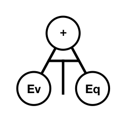

<p align="center">
	
</p>
<h1 align="center">
	EvEqT: Evolvable Equation Tree Library
</h1>
<p align="center">
  <b>Current Framework Version: 0.8.0</b>
</p>

**EvEqT** is a simple library to help researchers evolve equation trees that can be used in genetic programming. The library provide a lot of operators and some default operators to help with the genetic operators (crossover and mutation).

## Installation
There is more than one way to use that project:
- Copy the [`eveqt`](https://github.com/amidos2006/eveqt/tree/master/src/eveqt) package from the [`src`](https://github.com/amidos2006/eveqt/tree/master/src) folder to your project `src` folder.
- Add [`eveqt.jar`](https://github.com/amidos2006/eveqt/blob/master/build/eveqt.jar) that can be found in [`build`](https://github.com/amidos2006/eveqt/tree/master/build) folder as a dependency to your project.

Now you are ready to use the package check the [Usage](https://github.com/amidos2006/eveqt#usage) section

## Usage
You can check `Test.java` file for a full example on most of the functionalities that are available by **EvEqT**. Here is an example for couple of basic usages of **EvEqT**.
```java
// Construct the parser object, that object will need a random object and two hashset
// varNames hashset contains all the possible variable names that should be used in the equation
// constValues hashset contains all the possible constants to be used by the system
// if you want to generate that constValues quickly, try using EvEqT.generateConstants(20, 1000);
EquationParser parser = new EquationParser(new Random(), varNames, constValues);
// You could the parser object to parse an equation you had written
// (make sure it is a correct equation or the system will throw exceptions at you)
EquationNode handEquation = parser.parse("sub(mul(add(jump, sub(log(6), 20)),dash),attack)");
// Or you could send the parser object to EvEqT helper functions to generate a random equation tree
// maxDepth is the maximum tree depth
EquationNode randomEquation = EvEqT.generateRandomTreeEquation(parser, maxDepth);
```

To calculate the value of any equation it is pretty simple:
```java
// calculates the value of the equation using a dictionary of variable values
// varValues is a dictionary of all the defined variables in the hashset in the parser and their double value
System.out.println(equation.evalulate(varValues));
```

For modifications on an existing tree, you can check these functions:
```java
// Return a new simplified version of the input equation if there is a group of nodes that are constant
EquationNode simpleEquation = EvEqT.simplifyTree(parser, equation);
// Delete a random node from a clone copy of the input equation
EquationNode deletedEquation = EvEqT.deleteNode(parser, equation);
// Change a random node from a clone copy of the input equation
EquationNode changeEquation = EvEqT.changeNode(parser, equation);
// Insert a new node to a clone copy of the input equation
EquationNode addEquation = EvEqT.insertNode(parser, equation, 5);
// generate a hybrid child from mixing the two input equations
EquationNode crossEquation = EvEqT.crossoverTrees(parser, equation1, equation2);
```

## Features
- Ten different unary node operators
	- `abs`: calculates the absolute value of the child node
	- `floor`: calculates the floor value of the child node
	- `ceil`: calculates the ceiling value of the child node
	- `ln`: calculates the natural logarithmic of the child node
	- `neg`: calculates the additive inverse of the child node
	- `inv`: calculates the multiplicative inverse of the child node
	- `sigmoid`: calculates the sigmoid value of the child node
	- `tanh`: calculates the tanh value of the child node
	- `sin`: calculates the sin value of the child node
	- `cos`: calculates the cos value of the child node
- Fourteen different binary operators:
	- `add`: adds the values of the left and the right children
	- `sub`: subtracts the value of the right child from the left child
	- `divide`: divides the value of the right child from the left child
	- `div`: calculates the integer division of the right child from the left child
	- `mod`: calculates the modulus of the right child from the left child
	- `eq`: checks if both values are equal (1) or not (0)
	- `lg`: checks if the left node value larger than the right node value (1) or otherwise (0)
	- `ls`: checks if the left node value less than the right node value (1) or otherwise (0)
	- `max`: returns the maximum value of both the children values
	- `min`: returns the minimum value of both the children values
	- `mul`: multiplies both children values
	- `pow`: calculates the left child value to the power of the right child value
	- `randInt`: calculates a random integer number between the left child value to the right child value
	- `randFloat`: calculates a random float number between the left child value to the right child value
- Genetic modification functionalities
	- generate a random tree
	- delete a random node from a tree
	- add a new node to a tree
	- change terminal values or operator types
	- mix two different equation trees

## Adding new Unary Operator
You need to create a class in `eveqt.operators.unary` for your new operator where it will be extending `UnaryOperator` class. That class need to implements the following functions:
```java
/**
 * calculate the result of the operator using the value coming from the child node
 * this.child.evaluate(variables)
 **/
@Override
public double evaluate(HashMap<String, Double> variables) {
	...
}

/**
 * return the string format of the equation, the format has to be
 * "<operator-name>" + "(" + this.child.toString() + ")"
 **/
@Override
public String toString() {
	...
}
```
make sure that you remember the `<operator-name>` because you will need to add it into two other places in the `EquationParser` class in `eveqt` package:
- The first location is to add <operator-name> to `unaryOperator` arraylist at the beginning of the class
- The second location is to add it as a case in the switch statement in `getUnaryOperator` function in the middle of the class

## Adding new Binary Operator
You need to create a class in `eveqt.operators.binary` for your new operator where it will be extending `BinaryOperator` class. That class need to implements the following functions:
```java
/**
 * calculate the result of the operator using the values coming from the children node
 * this.left.evaluate(variables) and this.right.evaluate(variables)
 **/
@Override
public double evaluate(HashMap<String, Double> variables) {
	...
}

/**
 * return the string format of the equation, the format has to be
 * "<operator-name>" + "(" + this.left.toString() + "," + this.right.toString() + ")"
 **/
@Override
public String toString() {
	...
}
```
make sure that you remember the `<operator-name>` because you will need to add it into two other places in the `EquationParser` class in `eveqt` package:
- The first location is to add <operator-name> to `binaryOperator` arraylist at the beginning of the class
- The second location is to add it as a case in the switch statement in `getBinaryOperator` function in the middle of the class


## Contributing
Bug reports and pull requests are welcome on GitHub at [https://github.com/amidos2006/eveqt](https://github.com/amidos2006/eveqt).

## License
This code is available as open source under the terms of the [MIT License](https://opensource.org/licenses/MIT).
